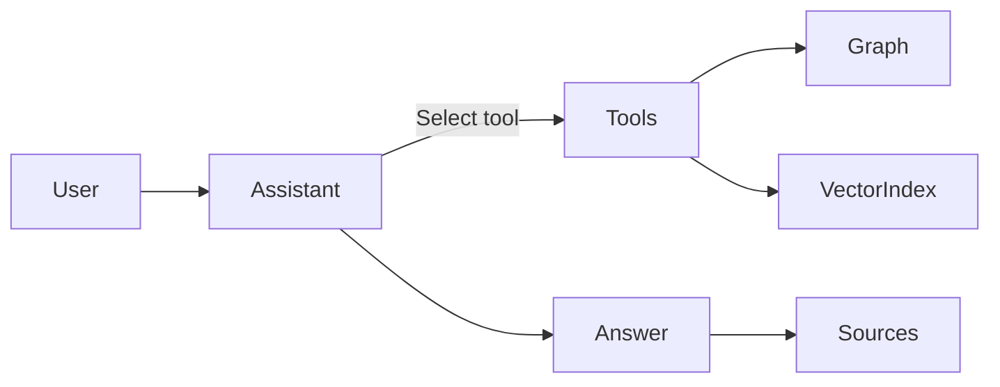

## What Is Semantic RAG?

Vedana is built on an architecture called Semantic RAG. Where classic RAG treats every question as a retrieval problem, Semantic RAG treats it as a reasoning problem: the system first understands what the question is actually asking, then selects the right tool to answer it precisely.
The result is an assistant that doesn't guess, it computes and gives a precise answer.

## The Four Components

Semantic RAG is not simply "search + LLM." It is a system built from four interdependent components:

**Data Model + Tools + Data + Assistant**

All four parts work together to produce precise, verifiable answers to questions.


A **Semantic RAG** system consists of:

- Data – the raw material: documents, records, and structured entities.
- Data Model – a structured representation of the domain and the relationships within it.
- Tools – capabilities the assistant can invoke: queries, graph traversal, counting, filtering.
- Assistant – an LLM-powered agent that knows when and how to use the right tool for a given question.

Without structure and tools, the assistant guesses answers.
With structure and tools, the assistant understands the question fully and gives a precise answer.

## How It Differs from Classic RAG

Classic RAG operates on a flat pipeline:
```
Chunks → Top-K → LLM → Answer
```
It retrieves text that looks related and asks the LLM to synthesize it. This works for open-ended questions but fails the moment precision matters.

**Semantic RAG** adds structured awareness. The system:

- Knows what entities exist
- Knows how they relate
- Can count
- Can filter
- Can traverse relationships
- Can prove where the answer came from

Semantic RAG does not rely only on similarity alone. Similarity is one tool among many.

## “Understand, Not Guess”
The core principle of Semantic RAG is that the system should compute answers, not invent them.
To “understand” means:

- If the question asks “How many?”, the system actually counts.
- If the question asks “Show all”, it retrieves everything.
- If the question asks about compatibility, it checks relationships.

The assistant does not invent answers from text fragments.
It uses tools to compute answers.

## How It Works



The step-by-step process:

1. User asks a question.
2. Assistant detects intent.
3. Assistant selects the right tool, following the Playbook rules for this query type.
4. Tool queries structured data (Graph or Vector index).
5. Assistant formats the answer, combining results from one or more tool calls into a coherent response.
6. Sources are attached as evidence. Every fact is traceable to a specific record, chunk, or database row.
    
## Required Properties

A real Semantic RAG system must have:

- **Deterministic tool calls.** The assistant does not randomly decide which tool to use. It follows explicit rules defined in the Playbook. The same question type always maps to the same retrieval strategy.
- **Verifiable sources.** Every answer can be traced back to its origin: a document chunk ID, a database row, an API response. If a source cannot be cited, the answer is not trusted.
- **Exhaustive answers when required.** If the user asks for "all", the system returns all — not a sample, not a best guess. Completeness is guaranteed by the retrieval mechanism, not assumed.

If any of these are missing, the system is still classic RAG regardless of what it is called.

## What Vedana Does Not Do

Vedana does not let the LLM freely invent logic, rely exclusively on embeddings, or treat all text as undifferentiated context. It also does not guarantee correctness without proper domain modeling.

Semantic RAG is not magic. It requires a structured model, clear rules, and well-defined tools. 
Because reliable answers require structure.
Not just probability.
