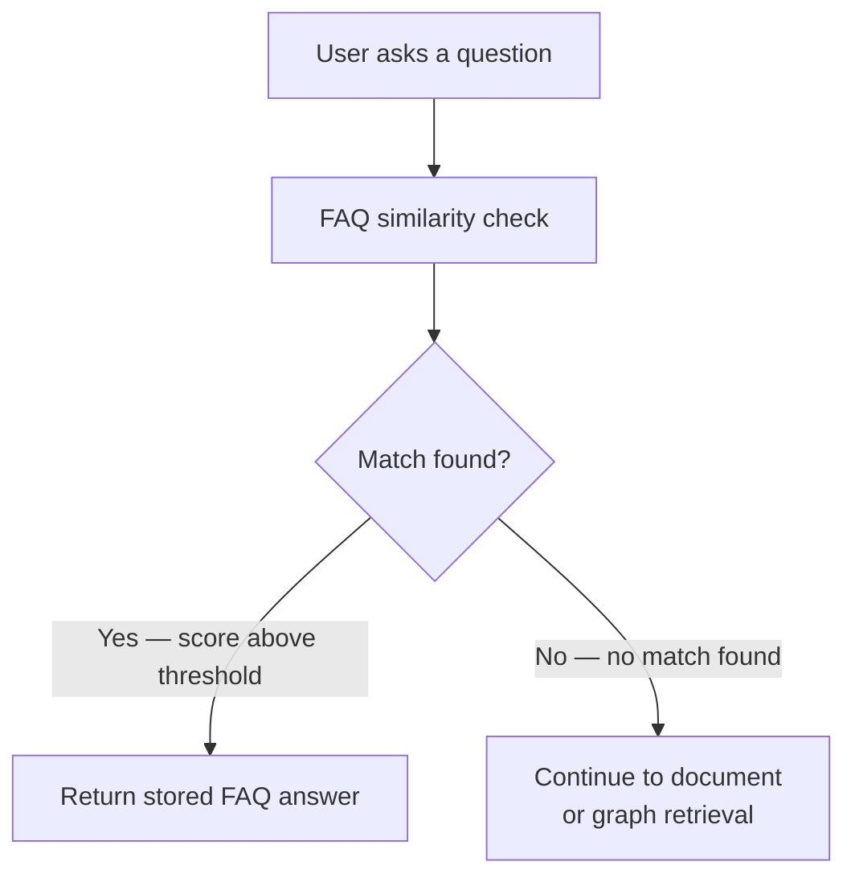

_This page assumes you have read [Data for Vedana](https://vedana.tech/docs/concepts/data-for-vedana/) and understand the three types of domain data Vedana supports._

## Overview

Vedana includes a built-in FAQ mechanism that works out of the box. It is the simplest way to provide short, consistent, high-confidence answers to known questions, no additional modeling required.

FAQ entries are stored in a dedicated table in Grist and retrieved directly at runtime. Because the answers are predefined, they do not vary between users or sessions. For questions where consistent wording matters, FAQ is the most reliable ingestion method available.

## What FAQ Is

FAQ is a dedicated table in Grist that stores predefined question-and-answer pairs. When a user asks a question that closely matches a FAQ entry, the stored answer is returned directly – without querying the graph, searching documents, or involving any retrieval logic beyond similarity matching.

This makes FAQ the simplest and most controlled ingestion method in Vedana. The answer is fixed. It does not vary between users, sessions, or phrasings that cross the match threshold. If consistent wording matters — for support responses, policy statements, operational answers — FAQ is the most reliable way to achieve it.

## FAQ Table Structure

The FAQ table lives in Grist and contains two columns:

|Column|Content|
|---|---|
|**question**|A representative phrasing of the question|
|**answer**|The exact answer to return|

Each row is one FAQ entry. 
The table is predefined and ready to use — you only need to populate it.

## How FAQ Retrieval Works

When a user sends a question, the system checks the FAQ table first, before any other retrieval occurs. The user's question is embedded and compared against the `question` column of the FAQ table using vector similarity. If the similarity score exceeds the configured threshold, the corresponding `answer` is returned.

The workflow:
1. User asks a question.
2. System checks FAQ intent.
3. Vector similarity (or direct matching) is applied to the `question` column.
4. Matching FAQ entry is retrieved.
5. The corresponding `answer` is returned or formatted.

mermaid

FAQ retrieval bypasses graph traversal and document retrieval entirely. It is lightweight, fast, and efficient. A well-matched FAQ entry always returns the same answer.

The threshold that controls what counts as "close enough" is configured in the data model. If FAQ entries are matching too broadly or too narrowly, adjusting this threshold is the first place to look.

## How FAQ Differs from Documents and Structured Data

FAQ, documents, and structured data each serve a different purpose. Choosing the wrong one for a given piece of knowledge is one of the most common causes of inconsistent or unreliable responses.

**Use FAQ** when the answer is short, fixed, and should not vary. Business hours, return policies, contact details, standard support responses. The answer is authoritative and should be returned verbatim.

**Use documents** when the answer is long, contextual, or requires interpretation. Policy documents, manuals, contract text. The user is asking what something says, not what the value is.

**Use structured data** when the answer depends on a specific attribute, a count, a filter, or a relationship. Product prices, branch locations, contract dates. The user is asking for a precise value that can be computed from the graph.

The most frequent mistake is using FAQ for questions that should be structured data, or using documents for questions that should be FAQ. A branch's opening hours entered as a FAQ entry works but it cannot be filtered, compared, or updated without editing the FAQ row manually. The same data modeled as a Branch anchor with an `opening_hours` attribute can be updated in one place and queried precisely for any branch.

## What FAQ Does Not Do

FAQ is a lookup table, not a reasoning layer. It does not synthesize answers from multiple entries, follow relationships, or adapt its answer based on context. If the question does not match a stored entry above the threshold, FAQ returns nothing and the system continues to other retrieval methods.

It also does not scale well as the primary answer mechanism for a large domain. As the FAQ table grows, entries with overlapping intent can compete with each other, producing inconsistent matching. FAQ works best as a small, curated set of high-confidence entries — not as a substitute for a properly modeled domain.

**Next step:** [How to Add FAQ Entries] — a practical guide to writing effective questions and answers in Grist.
