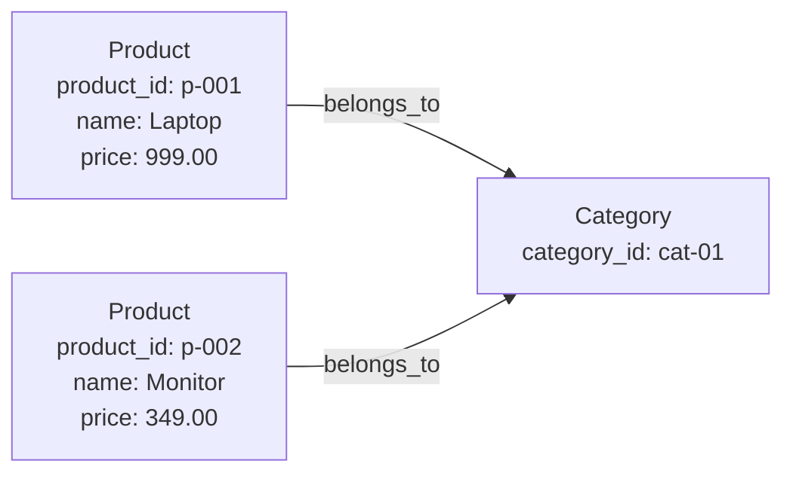
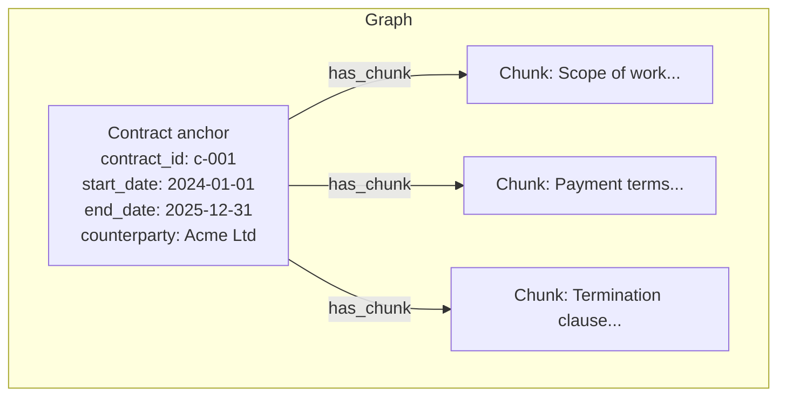

_Part of [Data for Vedana](https://vedana.tech/docs/concepts/data-for-vedana/). For step-by-step ingestion instructions, see [How to Add Structured Data]._

## What Structured Data Is

Structured data is domain knowledge expressed as typed entities with queryable attributes and explicit relationships. Instead of storing information as text to be searched by meaning, it is stored as nodes in the graph with specific typed properties like numbers, strings, dates, booleans, that can be filtered, compared, and traversed exactly.

A product catalog, a list of branch locations, a table of contracts with start and end dates, a compliance mapping between product categories and regulatory requirements — these are all structured data. Each row in the source table becomes an anchor node in the graph, each column becomes an attribute on that node, and relationships between tables become typed edges between nodes.

## When to Use Structured Data

The clearest signal that data should be structured rather than stored as documents is the nature of the questions users will ask. If the correct answer to a question is a specific value — a number, a date, a name, a yes or a no — that data should be structured.

Questions that require structured data:

- "Which products cost less than 500?"
- "What time does the Vilnius branch close on Sunday?"
- "Which contracts expire this month?"
- "Which requirements apply to this product category?"

None of these can be answered reliably by searching for similar text. A vector search might retrieve a paragraph that mentions a price, but it cannot filter all products below a threshold, return a complete list, or guarantee the answer is current and exact. These questions need a query, not a similarity match.

A rule of thumb: if you would normally answer the question by opening a spreadsheet and applying a filter, the underlying data should be structured in Vedana.

## How Tables Become Graphs

When structured data is ingested, each source table is mapped to the data model before ETL runs. This mapping defines three things for every table: what the anchor type is, which columns become attributes on that anchor, and whether any columns represent relationships to other anchor types that should become graph edges.

Take a products table as an example:

|product_id|name|price|category_id|
|---|---|---|---|
|p-001|Laptop|999.00|cat-01|
|p-002|Monitor|349.00|cat-01|

The mapping declares:

- **Anchor type:** Product
- **Attributes:** `name` (string), `price` (float)
- **Link:** `category_id` → `belongs_to` → Category anchor

After ETL, the graph looks like this:

Now Vedana can answer "Which products cost less than 500?" with a Cypher query that filters on `price` and returns every matching node — not an approximation, not a sample, but every record that satisfies the condition.

## Combining Structured Data and Documents

Structured data and documents are not alternatives — they are complementary, and the most effective deployments use both together. Each handles what the other cannot.

Consider a contract. The full contract text should be stored as document chunks, so the assistant can retrieve and explain specific clauses in response to open-ended questions. At the same time, the key structured fields — contract ID, start date, end date, counterparty name — should be extracted and stored as a structured anchor.

With this structure, "When does this contract expire?" is answered deterministically via Cypher against the structured anchor. "What does the termination clause say?" is answered via vector search over the document chunks. The same entity is queryable two different ways, for two different kinds of question.

This hybrid approach is the recommended strategy for any content type that has both factual attributes and explanatory text.

## What Structured Data Enables

With a properly modeled structured layer, Vedana can:

- Filter by exact attribute values — price, date, status, category
- Return exhaustive lists — every product in a category, every contract expiring this quarter
- Traverse multi-hop relationships — which legal documents regulate products in category X, where category X is linked to products which are linked to regulatory requirements
- Combine structured filters with document retrieval in a single response

None of this is possible with document chunks alone. Chunks are the right tool for finding meaning in text. Structured anchors are the right tool for reasoning over a domain.

**Next step:** [How to Add Structured Data](https://vedana.tech/docs/preparing-data-for-vedana/structured-data/) — how to prepare your tables, map them to the data model, and ingest them via Grist.
