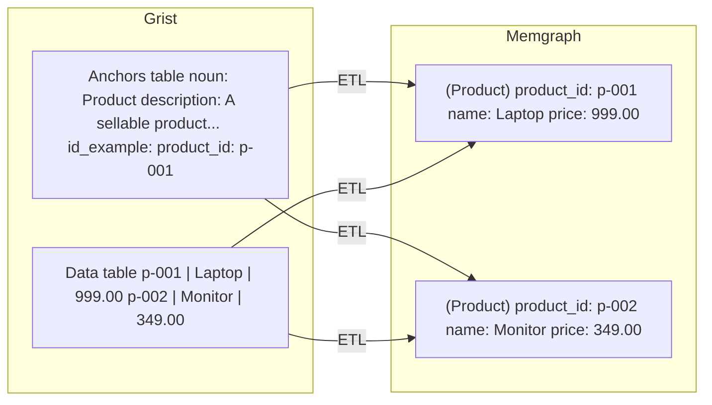

_For step-by-step instructions on defining anchors in Grist, see [How to Define Anchors]._

## What an Anchor Is

An **anchor** is a core entity type in the Vedana data model. It represents a real-world or logical object in your domain, the things your system knows about and can reason over. Every class of thing your assistant can look up, filter, count, or traverse is defined as an anchor type.

Examples from common domains:

- Product, Category, PriceList
- Branch, Region, Warehouse
- Contract, Counterparty, Requirement
- Department, Employee, Service

In Memgraph, each anchor type corresponds to a class of nodes. When you define a `Product` anchor and run ETL, every row in your products table in Grist becomes a typed `Product` node in the graph, with its columns stored as properties on that node.

Anchors are schema definitions, not data. The Anchors table in Grist describes _what kinds of things exist_, not the things themselves. The actual entity data lives in your domain tables and is written to Memgraph during ETL.

## What an Anchor Produces in the Graph

To make this concrete: a single row in the Anchors table, combined with the corresponding rows in your data table, produces this structure in Memgraph after ETL runs:

Each node carries a label (`Product`) that comes from the anchor definition, and properties that come from the data rows. The label is what allows Cypher queries to find and filter nodes of that type specifically.

## How to Define an Anchor
Every anchor definition needs four fields. All are required — incomplete definitions will either fail during ETL or produce unreliable behavior at query time.

| Field           | What it contains                                                                                                                                                                                                                                                                  |
| --------------- | --------------------------------------------------------------------------------------------------------------------------------------------------------------------------------------------------------------------------------------------------------------------------------- |
| **Noun**        | The entity name: singular, English, unique across the data model. This becomes the node label in Memgraph. Use `Product`, not `Products` or `product_catalog`.                                                                                                                    |
| **Description** | A plain-language explanation of what this entity represents. This is included in the LLM context — the assistant uses it to decide when to query this anchor type. the clearer and more specific it is, the better the assistant will understand when and how to use this anchor. |
| **ID example**  | A real example of a primary key value from your data (e.g. `product_id: "123"`). This helps the ETL process and the LLM understand what a valid identifier looks like for this entity type.                                                                                       |
| **Query**       | The Cypher query used to retrieve nodes of this type from Memgraph. Without a valid query here, the assistant cannot reliably fetch this entity from the graph.                                                                                                                   |

All four fields are required. An anchor definition with missing or vague entries will either fail during ETL or produce unreliable behavior at query time. The Description field deserves particular care. It is the primary mechanism through which the assistant learns what an anchor represents and when to use it. A description like _"Represents a product"_ tells the assistant almost nothing. A description like _"A sellable product in the catalog, with a price, availability status, and category. Use this anchor to answer questions about specific products, prices, and stock levels"_ gives it enough context to make correct decisions.

The Query field is the other common gap. An anchor without a valid Cypher query cannot be retrieved deterministically. The assistant will fall back to less precise methods. See [How to Define Anchors] for query examples.

## How Anchors Affect the Assistant

Anchor definitions are included directly in the LLM context at query time. The assistant sees the full list of anchor types, their names, and their descriptions before it processes any user question. This is what allows it to:

- Recognize which entity type a question is about
- Generate correct Cypher queries using the right node labels
- Select the appropriate retrieval tool
- Understand the vocabulary of your domain rather than guessing

If anchors are poorly defined (vague descriptions, inconsistent naming, missing primary keys), the assistant cannot reason correctly. It may query the wrong entity type, generate invalid Cypher, or fall back to text similarity when a structured query would give a better answer. The quality of anchor definitions is one of the highest-leverage things you can control in Vedana.

## What Anchors Are Not

Anchors are not rows of data. They are not prompt instructions. They are not temporary or session-specific objects. They are stable schema definitions that describe the structure of your domain — analogous to a table definition in a relational database, not to the rows inside it.

Document chunks are a specific built-in anchor type, pre-configured in the default data model. Most anchors you define will be structured domain entities: products, contracts, branches, employees, or whatever your domain requires.

**Next step:** [How to Define Anchors] — how to fill in the Anchors table in Grist correctly, with examples and common mistakes.
