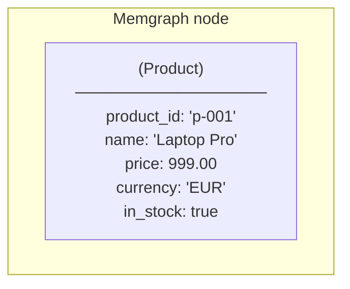
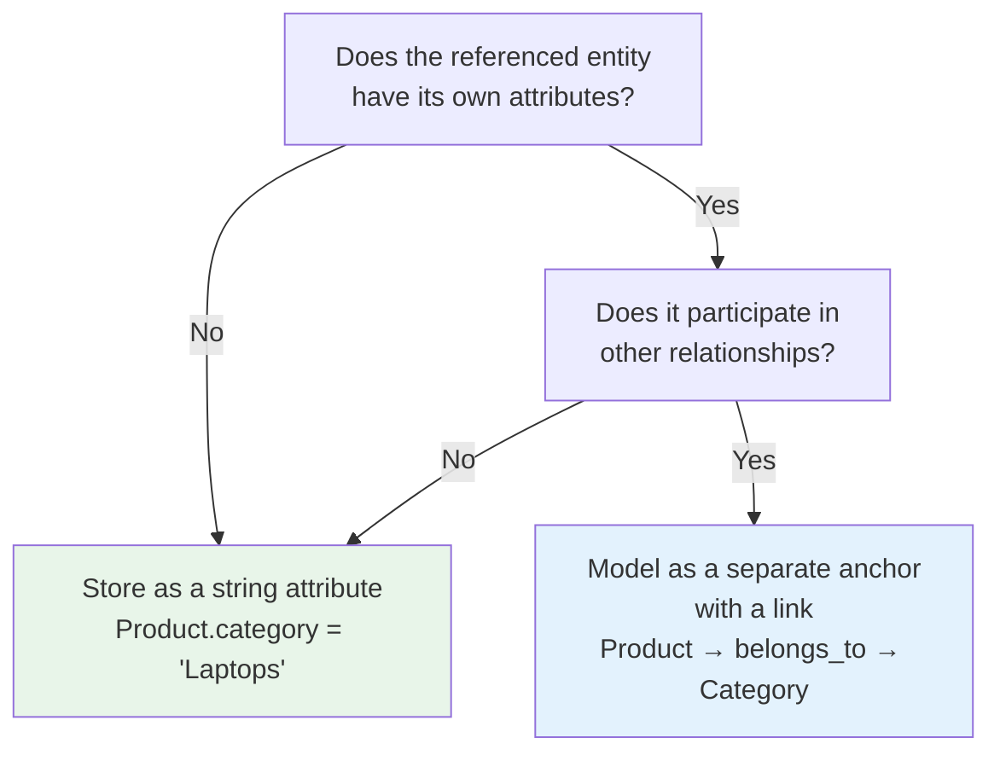

## What Is an Attribute

An attribute is a typed property attached to an anchor. If anchors define what exists, attributes define what we know about it — the specific, queryable data that describes each entity.

For a `Product` anchor, attributes might include `name` (string), `price` (float), `currency` (string), and `in_stock` (boolean). 

For a `Branch` anchor: `address` (string), `city` (string), `opening_hours` (string). 

For a `Contract`: `start_date` (date), `end_date` (date), `counterparty` (string).

Attributes are what make precise filtering possible. Without them, Vedana behaves like basic RAG: it can retrieve documents that mention a product's price, but it cannot filter products by price. The difference between approximate retrieval and deterministic answers comes down to whether the relevant data is stored as a typed attribute.

## How Attributes Sit in the Graph

Each attribute becomes a property on a node in Memgraph. After ETL runs, a Product node with three declared attributes looks like this:

The properties on the node are exactly the attributes you declared. No more, no less. If a column exists in your Grist data table but is not declared as an attribute in the data model, it will not appear on the node and cannot be queried.

## Where Attributes Are Defined

Attributes are defined in **Grist > Data Model > Attributes** table. 
Like the Anchors table, this table contains schema definitions, not actual data values. The actual values live in your business tables (e.g. `products`, `branches`). 
The Attributes table tells Vedana what those values are and how to use them.

During ETL:
1. Attribute schema is loaded.
2. Types are validated.
3. Rows are checked against schema.
4. Properties are written to Memgraph nodes.

## How to Describe an Attribute

Each attribute definition typically includes:
- anchor_name (which anchor it belongs to)
- attribute_name
- data_type 
- description  
- optional flags (filterable, searchable, embeddable) 

Attributes must always belong to an anchor type.

### Required Fields for an Attribute Definition

Each row in the Attributes table in Grist defines one property on one anchor type.

| Field               | What it contains                                                                                    |
| ------------------- | --------------------------------------------------------------------------------------------------- |
| **Attribute Name**  | System name of the attribute: lowercase, no spaces, matching the column name in your data table     |
| **Description**     | Plain-language explanation of what this attribute represents — included in LLM context              |
| **Anchor**          | The anchor type this attribute belongs to                                                           |
| **Link**            | Set to true if this field is a foreign key reference to another anchor, rather than a scalar value  |
| **Data example**    | A real example value from your data (e.g. `999.00`, `"Vilnius"`, `true`)                            |
| **Embeddable**      | Whether the value should be vectorized for semantic search                                          |
| **Query**           | The Cypher query used to retrieve this attribute from the graph                                     |
| **dtype**           | The data type: `str`, `int`, `float`, `bool`, `date`, `datetime`, `enum`, `url`, or `file`          |
| **embed_threshold** | Similarity score threshold for semantic search on this field (only applies when Embeddable is true) |

Two fields deserve extra attention.

**dtype** must exactly match what is stored in your Grist data table. If a price column contains values like `"999.00"` (a string with quotes) but dtype is declared as `float`, ETL will either fail or write the value incorrectly. Check your actual data before declaring a type.

**Query** is required for any attribute that should be directly retrievable. A missing or empty query here is one of the most common causes of the assistant returning vague or incomplete answers — it knows the attribute exists but cannot reliably fetch its value from the graph.

## Embeddable Attributes and Semantic Search

Attributes marked as **Embeddable** are vectorized during ETL. Their values are stored as embeddings alongside the node in Memgraph, making them available for semantic search — the assistant can find nodes by the meaning of an attribute value, not just by exact match.

Embeddable is appropriate for human-readable text fields where users might search by phrasing rather than exact value: product names, descriptions, interest names, category labels. It is not appropriate for identifiers, numeric values, boolean flags, or structured codes.

The **embed_threshold** controls how similar a query must be to a stored value before the result is returned. Setting it too low returns loosely related results. Setting it too high misses valid matches. The right threshold depends on how precise the expected queries are for that field — start at 0.7 and adjust based on evaluation results.

## Attribute vs Link

Not every value that references another entity should be an attribute. This is one of the most consequential modeling decisions you will make.

**Use an attribute** when the value is a scalar — a number, a date, a string, a flag — and it exists only to describe this entity. `Product.price`, `Branch.opening_hours`, `Contract.end_date` are all attributes.

**Use a link** when the value references another entity that has its own attributes or appears in other relationships. `Product.category_id` pointing to a categories table is a candidate for a link, not an attribute, if categories have their own properties (like a description or a parent category) or appear in other relationships (like `Category → regulated_by → LegalRequirement`).

The practical difference: a string attribute lets you filter products by category name. A link to a Category anchor lets you traverse from products to categories to everything the category is connected to — regulatory documents, related categories, products in sibling categories. The more the referenced entity participates in the graph, the stronger the case for a link.

## How Attributes Affect the Assistant

The full set of attribute definitions is included in the LLM context at query time. The assistant sees which properties exist on each anchor type, what their data types are, and what they mean. This is what allows it to generate valid Cypher filters, apply numeric comparisons correctly, and avoid inventing fields that do not exist in the schema.

An attribute that is not declared does not exist from the assistant's perspective, even if the data is present in the graph. Define every property that users might ask about.

Next step:** [How to Define Attributes] — how to fill in the Attributes table in Grist, with examples, dtype reference, and common mistakes.
