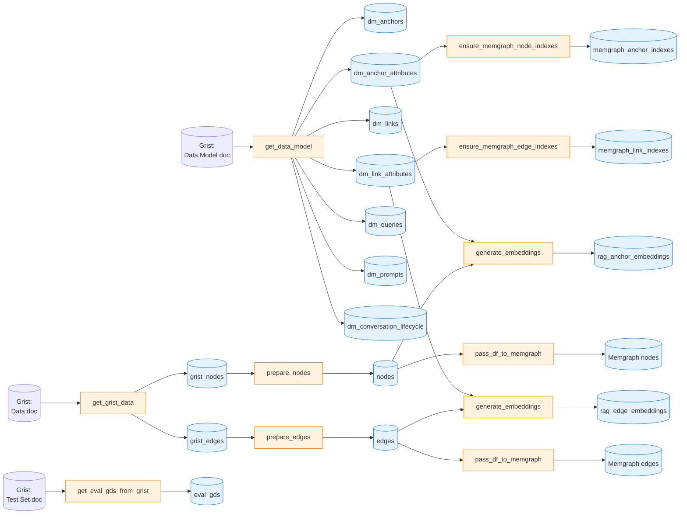

# Vedana ETL

`vedana-etl` is an incremental ETL pipeline built on [Datapipe](https://github.com/epoch8/datapipe) that:

- reads the data model and the data itself from **Grist**;
- converts them into graph structures (anchors, links);
- loads nodes and edges into **Memgraph**;
- generates embeddings for embeddable fields and writes them to **pgvector**;
- supports an evaluation pipeline with a golden dataset.

## Where to look

| File                                          | What's inside                                                |
| --------------------------------------------- | ------------------------------------------------------------- |
| `libs/vedana-etl/src/vedana_etl/catalog.py`   | All Datapipe tables and their schemas.                       |
| `libs/vedana-etl/src/vedana_etl/steps.py`     | Step implementations (`get_data_model`, `get_grist_data`, …). |
| `libs/vedana-etl/src/vedana_etl/pipeline.py`  | Assembling the pipeline from steps.                           |
| `libs/vedana-etl/src/vedana_etl/store.py`     | Custom Datapipe stores.                                       |
| `libs/vedana-etl/src/vedana_etl/schemas.py`   | `GENERIC_NODE_DATA_SCHEMA`, `GENERIC_EDGE_DATA_SCHEMA`.       |
| `libs/vedana-etl/src/vedana_etl/config.py`    | `DBCONN_DATAPIPE`, `MEMGRAPH_CONN_ARGS`.                      |
| `libs/vedana-etl/src/vedana_etl/settings.py`  | `Settings` (env).                                              |

## ETL pipeline DAG



## Datapipe in brief

Datapipe is an incremental ETL framework. Each step (`BatchTransform`, `BatchGenerate`) describes:

- which tables it reads (`inputs`);
- which tables it writes (`outputs`);
- which keys it transforms by (`transform_keys`);
- which function to call (`func`).

Datapipe tracks which rows changed and recomputes only those. This is especially valuable for embeddings: embeddings are recomputed only for nodes whose relevant attribute changed.

## Table catalog

### Data model

Populated by `data_model_steps` from Grist:

| Table                          | What it stores                                                |
| ------------------------------ | -------------------------------------------------------------- |
| `dm_anchors`                    | node types (`noun`, `description`, `id_example`, `query`)      |
| `dm_anchor_attributes`          | properties of nodes                                            |
| `dm_links`                      | edge types                                                      |
| `dm_link_attributes`            | properties of edges                                             |
| `dm_queries`                    | playbook                                                        |
| `dm_prompts`                    | prompt templates                                                 |
| `dm_conversation_lifecycle`     | system messages (e.g. `/start`)                                |

### Raw data from Grist

Populated by `grist_steps`:

| Table         | What it stores                                                                                              |
| ------------- | ----------------------------------------------------------------------------------------------------------- |
| `grist_nodes` | nodes from Grist (`node_id`, `node_type`, `attributes` — JSON with all the fields)                          |
| `grist_edges` | edges (`from_node_id`, `to_node_id`, `edge_label`, `attributes`)                                            |

### Intermediate

| Table  | What it stores                                                |
| ------ | ------------------------------------------------------------- |
| `nodes` | prepared nodes (after `prepare_nodes`)                       |
| `edges` | prepared edges (after `prepare_edges`)                        |

### Loading into Memgraph

| Table                        | Storage              | What it stores                                                  |
| ---------------------------- | -------------------- | --------------------------------------------------------------- |
| `memgraph_anchor_indexes`    | Postgres             | record of created indexes per anchor.attribute                  |
| `memgraph_link_indexes`      | Postgres             | record of created indexes per link.attribute                    |
| `memgraph_nodes`             | Memgraph (Neo4JStore)| the actual graph nodes                                           |
| `memgraph_edges`             | Memgraph (Neo4JStore)| the actual graph edges                                           |

### Embeddings (pgvector)

| Table                    | Columns                                                                            |
| ------------------------ | ----------------------------------------------------------------------------------- |
| `rag_anchor_embeddings`  | `node_id, node_type, attribute_name, attribute_value, embedding (Vector)`          |
| `rag_edge_embeddings`    | `from_node_id, to_node_id, edge_label, attribute_name, attribute_value, embedding` |

The vector dimensionality is `core_settings.embeddings_dim` (default 1024). Changing it requires a SQL migration.

### Evaluation

| Table       | What it stores                                                                |
| ----------- | ------------------------------------------------------------------------------ |
| `eval_gds`  | the golden dataset from Grist: `gds_question, gds_answer, question_scenario, question_comment, question_context` |

## Pipeline steps

### `data_model_steps`

```python
BatchGenerate(
    func=steps.get_data_model,
    outputs=[dm_anchors, dm_anchor_attributes, dm_link_attributes, dm_links, dm_queries, dm_prompts, dm_conversation_lifecycle],
    labels=[("flow", "regular"), ("flow", "on-demand"), ("stage", "extract"), ("source", "Data Model"), ("stage", "data-model")],
)
```

`get_data_model()` is a generator that reads Grist via `GristCsvDataProvider`, picks the relevant tables (`Links`, `Anchor_attributes`, `Link_attributes`, `Anchors`, `Queries`, `Prompts`, `ConversationLifecycle`), normalises them, and yields a tuple of DataFrames.

### `grist_steps`

```python
BatchGenerate(
    func=steps.get_grist_data,
    outputs=[grist_nodes, grist_edges],
    labels=[("flow", "on-demand"), ("stage", "extract"), ("source", "Grist"), ("stage", "grist")],
)
```

Reads the domain data. The default implementation uses Grist; you can override.

### `default_custom_steps`

```python
BatchTransform(prepare_nodes, inputs=[grist_nodes], outputs=[nodes], transform_keys=["node_id"]),
BatchTransform(prepare_edges, inputs=[grist_edges], outputs=[edges], transform_keys=["from_node_id", "to_node_id", "edge_label"]),
```

This is the "section you can swap" — if your source isn't Grist, you write your own `prepare_nodes` / `prepare_edges` that turn DataFrames into the `GENERIC_NODE_DATA_SCHEMA` / `GENERIC_EDGE_DATA_SCHEMA` shape. See [Custom ETL](../data-ingestion/custom-etl.md).

### `memgraph_steps`

Loading into the graph and embeddings:

- `ensure_memgraph_node_indexes` — creates label indexes and uniqueness constraints on `id` for each anchor label. (Vector indexes are commented out — Vedana moved embeddings to pgvector. See `vedana_etl/steps.py:462-518`.)
- `ensure_memgraph_edge_indexes` — creates edge indexes for each link label. (Vector edge indexes are commented out for the same reason.)
- `pass_df_to_memgraph` (for `nodes`/`edges`) — writes nodes and edges into Memgraph via `Neo4JStore`.
- `generate_embeddings` — for each row in `nodes` / `edges`, build embeddings for every embeddable attribute via `LLMProvider.create_embeddings_sync` (synchronous batched call).

### `eval_steps`

```python
BatchGenerate(
    func=steps.get_eval_gds_from_grist,
    outputs=[eval_gds],
    labels=[("pipeline", "eval"), ("flow", "eval"), ("stage", "extract")],
)
```

Loads the golden dataset from Grist (DocId — `GRIST_TEST_SET_DOC_ID`).

## Pipeline assembly

```python
def get_pipeline(custom_steps: list) -> Pipeline:
    return Pipeline([
        *data_model_steps,
        *grist_steps,
        *custom_steps,    # <- this is where default_custom_steps or your custom ones go
        *memgraph_steps,
        *eval_steps,
    ])
```

`get_data_model_pipeline()` is a separate entry point that loads only the data model (for example, after editing the playbook without re-running data ingestion).

## How to run

In the backoffice (Reflex) the UI is already there: **ETL → Run Selected**. Under the hood it calls Datapipe steps filtered by labels.

From the CLI you can run via the standard `datapipe` — for example:

```bash
uv run python -m datapipe run --pipeline vedana_etl.app
```

Picking labels for a partial run:

- `flow=regular` — regular full run (data model + ingest + load).
- `flow=on-demand` — same but including chunks that need an explicit trigger.
- `flow=eval` — only the evaluation pipeline.
- `stage=extract` / `transform` / `load` — filter by stage.
- `source=Grist` / `source=Data Model` — isolate a particular source.

## Customization

The most common customisation points:

1. **Custom data source** — replace `grist_steps` / `default_custom_steps` with your own `BatchGenerate` / `BatchTransform`. The main thing is that the final shape of `nodes` / `edges` matches `GENERIC_NODE_DATA_SCHEMA` / `GENERIC_EDGE_DATA_SCHEMA`.
2. **Alternative embeddings store** — replace `rag_anchor_embeddings` / `rag_edge_embeddings` with your own Datapipe store (e.g. direct write to Pinecone). At the same time replace `VectorStore` in `vedana-core`.
3. **Custom normalisation rules** — modify `prepare_nodes` / `prepare_edges` or `clean_str` in `vedana_etl.steps`.
4. **Custom evaluation pipeline** — swap `eval_steps` (e.g. add a step that records results into your dashboard).
