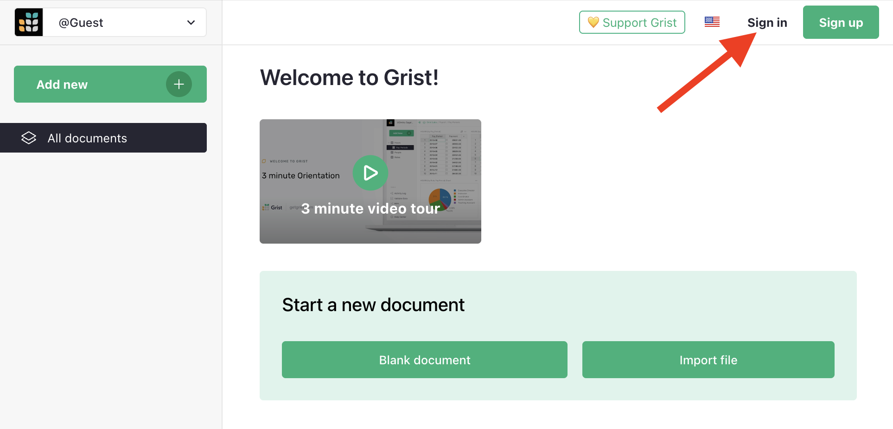
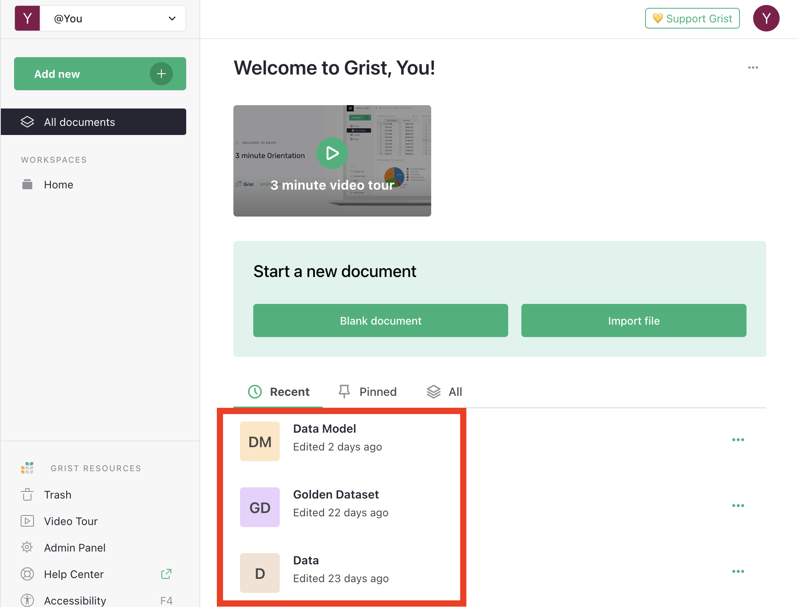
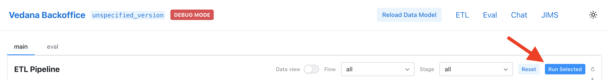
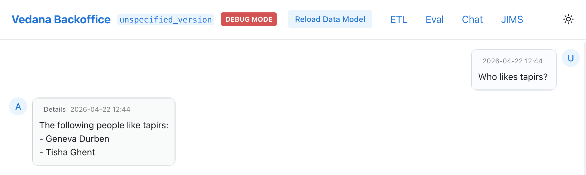
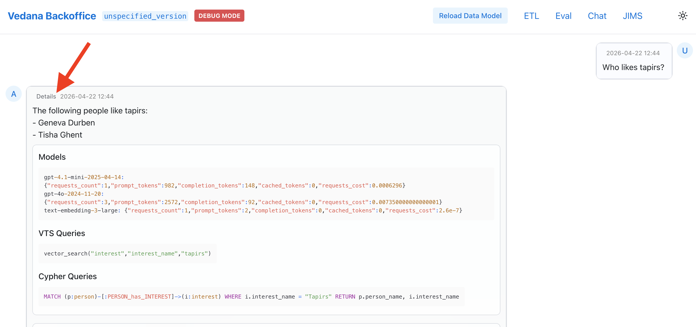

# Quick Start

In 10 minutes you'll:

1. Bring up the entire Vedana stack in Docker.
2. Load the test data model and data.
3. Run the ETL and confirm that the graph was built.
4. Ask your first question.
5. See exactly how the assistant arrived at the answer.

## Prerequisites

- Docker and Docker Compose installed.
- An LLM provider API key: OpenAI, OpenRouter, or Google/VertexAI (any combination — see [LLM configuration](./getting-started/configuration.md#llm)).
- ~5 GB of free disk space and ports `5432`, `7687`, `7444`, `3000`, `8080`, `8090`, `8484`, `9000` available.

## Step 1. Clone the repository and prepare `.env`

```bash
git clone https://github.com/epoch8/vedana
cd vedana

cp apps/vedana/.env.example apps/vedana/.env
```

Open `apps/vedana/.env` and set the key for at least one provider:

```env
# OpenAI
OPENAI_API_KEY="sk-..."

# or OpenRouter
OPENROUTER_API_KEY="sk-or-..."

# or Google / VertexAI
GOOGLE_APPLICATION_CREDENTIALS="path-to-creds.json"
```

The default models (`gpt-4.1-mini`, `text-embedding-3-large`) can be changed there too — see the [Configuration Reference](../api/configuration-reference.md).

## Step 2. Bring up the stack

```bash
docker compose -f apps/vedana/docker-compose.yml up --build -d
```

Compose will start six services:

| Service        | Purpose                                              | Port |
| -------------- | ---------------------------------------------------- | ---- |
| `app`          | Reflex backoffice + chat + ETL runner                | 9000 |
| `api`          | FastAPI HTTP API (`jims-api`)                        | 8080 |
| `widget`       | Embeddable web widget (`jims-widget`)                | 8090 |
| `db`           | PostgreSQL 15 with the `pgvector` extension          | 5432 |
| `memgraph`     | Memgraph (graph DB, Bolt protocol)                   | 7687 |
| `memgraph-lab` | Web inspector for Memgraph                           | 3000 |
| `grist`        | Grist (source of the data model and data)            | 8484 |

The `db-migrate` container automatically applies Alembic migrations before the main app starts.

## Step 3. Verify everything is alive

Open in your browser:

- Backoffice → <http://localhost:9000>
- HTTP API (Swagger) → <http://localhost:8080/docs>
- Memgraph Lab → <http://localhost:3000>
- Grist → <http://localhost:8484>

By default Grist loads three documents: **Data**, **Data Model**, and **Golden Dataset** (a test dataset based on LIMIT — see [Test Dataset](../guides/test-dataset.md)).

Sign in to Grist and confirm the documents are visible:





## Step 4. Run the ETL

Without ETL the graph is empty and the assistant has nothing to find.

1. Open the backoffice → **ETL** section → <http://localhost:9000/etl>.
2. Click **Run Selected** on the main tab.



ETL does three things: it loads the data model, loads the data, and builds the graph in Memgraph + the embeddings in pgvector. Wait until every step turns green.

## Step 5. Ask your first question

1. Open the chat → <http://localhost:9000/chat>.
2. Ask something about the test dataset:

   - "Who likes tapirs?"
   - "What are Geneva Durben's interests?"
   - "Who is into quokkas, and what else are they interested in?"



3. Click **Details** under the answer to see:
   - which Cypher queries the assistant ran;
   - which vector searches were issued;
   - how data model filtering shrank the context.



## Step 6. Stop the stack

```bash
# soft stop
docker compose -f apps/vedana/docker-compose.yml down

# stop and remove volumes (full reset)
docker compose -f apps/vedana/docker-compose.yml down -v
```

## What's next

- [Architecture](../architecture/overview.md) — how the code is structured.
- [Data Model Overview](../data-model/overview.md) — how to describe your own domain.
- [HTTP API](../api/http-api.md) — embed the assistant in your own system.
- [Common mistakes](../product/faq.md#common-mistakes) — typical pitfalls during the first launch.
